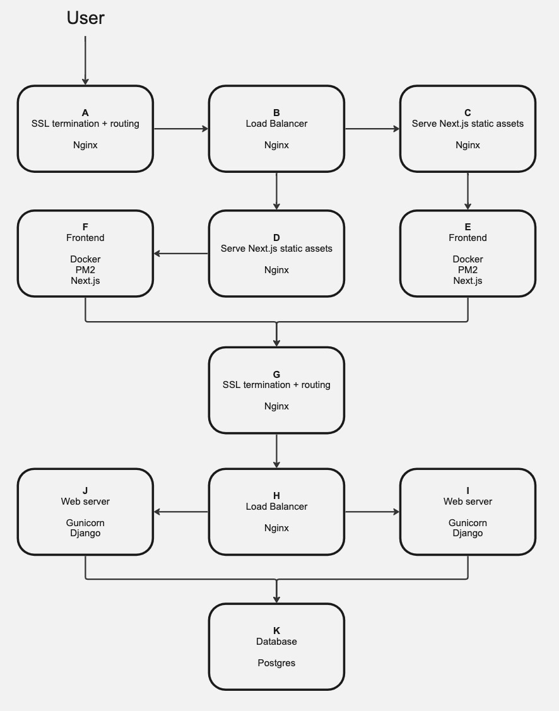
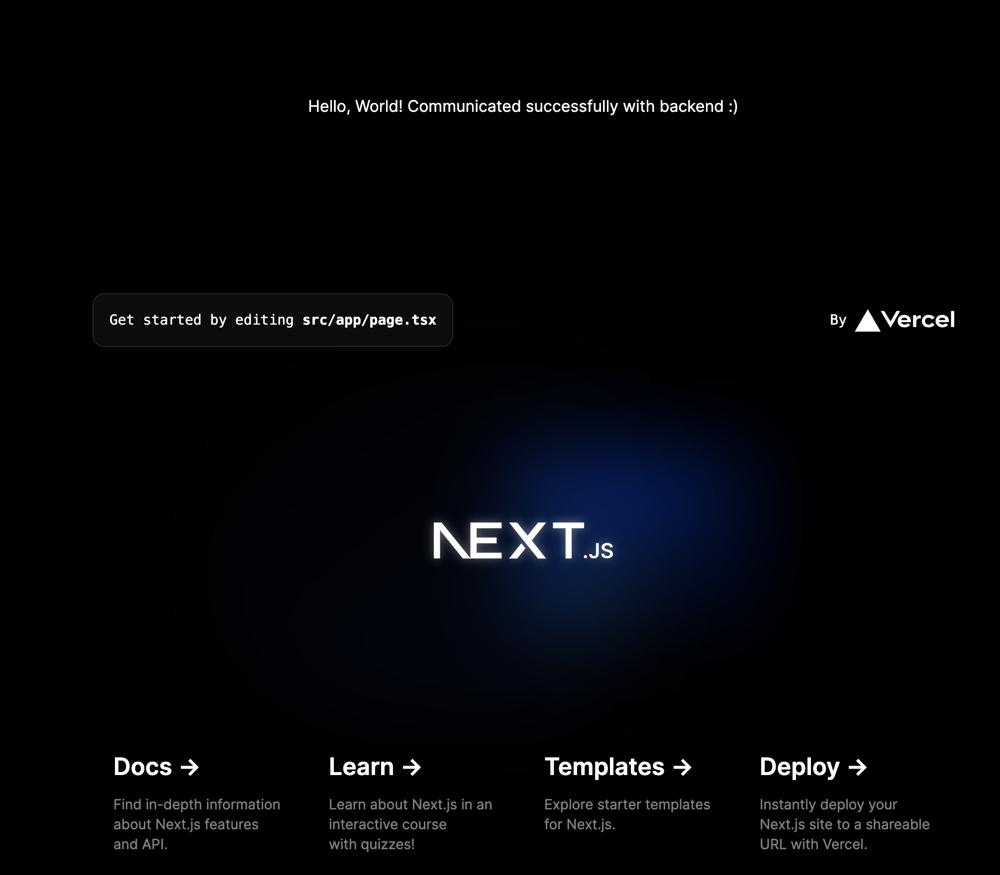

<!-- Improved compatibility of back to top link: See: https://github.com/othneildrew/Best-README-Template/pull/73 -->
<a name="readme-top"></a>
<!--
*** Thanks for checking out the Best-README-Template. If you have a suggestion
*** that would make this better, please fork the repo and create a pull request
*** or simply open an issue with the tag "enhancement".
*** Don't forget to give the project a star!
*** Thanks again! Now go create something AMAZING! :D
-->


<!-- PROJECT SHIELDS -->
<!--
*** I'm using markdown "reference style" links for readability.
*** Reference links are enclosed in brackets [ ] instead of parentheses ( ).
*** See the bottom of this document for the declaration of the reference variables
*** for contributors-url, forks-url, etc. This is an optional, concise syntax you may use.
*** https://www.markdownguide.org/basic-syntax/#reference-style-links
-->
<!-- [![Contributors][contributors-shield]][contributors-url]
[![Forks][forks-shield]][forks-url]
[![Stargazers][stars-shield]][stars-url]
[![Issues][issues-shield]][issues-url]
[![MIT License][license-shield]][license-url]
[![LinkedIn][linkedin-shield]][linkedin-url] -->


<!-- PROJECT LOGO -->
<br />
<div align="center">
  <a href="https://github.com/nimzyow/ansible-infra-project">
    
  </a>

  <h3 align="center">Education piece - Automating infrastructure with Ansible</h3>
</div>


<!-- TABLE OF CONTENTS -->
<!-- <details>
  <summary>Table of Contents</summary>
  <ol>
    <li>
      <a href="#about-the-project">About The Project</a>
      <ul>
        <li><a href="#built-with">Built With</a></li>
      </ul>
    </li>
    <li>
      <a href="#getting-started">Getting Started</a>
      <ul>
        <li><a href="#prerequisites">Prerequisites</a></li>
        <li><a href="#installation">Installation</a></li>
      </ul>
    </li>
    <li><a href="#usage">Usage</a></li>
    <li><a href="#roadmap">Roadmap</a></li>
    <li><a href="#contributing">Contributing</a></li>
    <li><a href="#license">License</a></li>
    <li><a href="#contact">Contact</a></li>
    <li><a href="#acknowledgments">Acknowledgments</a></li>
  </ol>
</details> -->


<!-- ABOUT THE PROJECT -->
## About The Project

You're a developer and you want to ship your awesome application. It's easy and you have so much choice whether it's through Netlify, Vercel, AWS Amplify or the 1000 other PaaS. In most cases you sign up to a PaaS and do the following:

* Point to your repository
* ???
* Profit

Just to be clear, this is a great thing and it allows developers to focus on bringing value to their application.

I've often been curious about what goes on behind the hood though, especially when it comes to production environments. I hear of load balancing, nginx, caching, SSL termination, MTLS, configuring databases in Linux, security and all these other scary things when it comes to infrastructure. Also how do you configure the infrastructure to serve an application in production?

The point of this project is to help provide an understanding of infrastructure and to know a bit about what's being abstracted away by a PaaS.

One way of approaching this is to identify the individual components needed, like an nginx load balancer, sign up to a cloud provider like AWS, spin up an EC2 instance, ssh into it, install all of the necessary dependencies for nginx, install nginx and configuring nginx and using systemctl to restart the nginx service. This is a rather long winded, highly manual and it'll cost money.

So instead of EC2 instances, what if we could use vagrant machines on your local machine instead and assign an ip address to each vagrant machine? And instead of manually SSH'ing into your vagrant machine and configuring it each time, what if you could automate this process in an idempotent way? In fact, what if you could spin up a vagrant machine, install dependencies for nginx, install nginx, configure nginx, restart nginx and confirm it's all working in an automated and idempotent way?

My friends, this is what this project is all about. This project is an attempt for me to educate myself on what is generally required, from an infrastructure perspective and configuration perspective, to deploy a website that has a client, server and database. We'll be spinning up Vagrant machines and setting them all up to get an idea of what it takes to deploy an application and what a PaaS might be abstracting away from us.

The automation is achieved with Ansible, an automation tool by RedHat. Though we could use bash scripts to write our automation, coding for idempotency is notoriously difficult. Ansible is an industry standard tool for automation that handles idempotency so it only makes sense to use the right tool for the right job. Although I am aware of Chef and dabbled a bit in it, my preference is Ansible so that's what's being used here. 

<!-- ABOUT THE PROJECT -->
## Diagram of project

<div align="center">
  
</div>
<br/>

### Built With

* Ansible
* Vagrant
* Next.js
* Docker
* nginx
* Django
* Postgres
* 
<!-- 
* [![Next][Next.js]][Next-url]
* [![React][React.js]][React-url]
* [![Vue][Vue.js]][Vue-url]
* [![Angular][Angular.io]][Angular-url]
* [![Svelte][Svelte.dev]][Svelte-url]
* [![Laravel][Laravel.com]][Laravel-url]
* [![Bootstrap][Bootstrap.com]][Bootstrap-url]
* [![JQuery][JQuery.com]][JQuery-url] -->

<!-- <p align="right">(<a href="#readme-top">back to top</a>)</p> -->


<!-- GETTING STARTED -->
## Getting Started

### Prerequisites

Ensure you have Ansible and Vagrant installed. If you do not have these installed, the start up script will prompt you with how to install these.

<!-- USAGE EXAMPLES -->
### Usage

_Below is an example of how you can instruct your audience on installing and setting up your app. This template doesn't rely on any external dependencies or services._

To start the project
   ```bash
    ./infra/deploy-infra.sh
  ```
  The above shell script will run an Ansible playbook to start the entire project.

To destroy the project
   ```bash
   ./infra/destroy-infra.sh
   ```
The above shell script will run an Ansible playbook to destroy the entire project.

Though you don't need to, if you wish to amend any variables related to this project, they can be amended in the ```infra/vars/main.yml``` file.

When the ansible playbook has finished, go to your favourite web browser and enter the IP address of the frontendLoadBalancer found in ```./infra/Vagrantfile```. Example:
```
frontendLoadBalancer.vm.network "private_network", ip: "10.2.2.201"
```

You should see a next.js we application that can successfully communicate with the backend.

<div align="center">
  
</div>
<br/>


<p align="right">(<a href="#readme-top">back to top</a>)</p>

<!-- ROADMAP -->
## Roadmap

- [x] Add Kubernetes for orchestrating next.js containerised app
- [x] Add diagram of project
- [ ] Django admin accessible through through ip address of frontend/admin
- [ ] Write up about nginx servers for frontend
- [ ] Write up about SSL termination

<p align="right">(<a href="#readme-top">back to top</a>)</p>


<!-- CONTACT -->
## Contact

Nima Soufiani - [Linkedin](https://www.linkedin.com/in/nima-soufiani-555a76198/)

Project Link: [https://github.com/Nimzyow/ansible-infra-project](https://github.com/Nimzyow/ansible-infra-project)

<p align="right">(<a href="#readme-top">back to top</a>)</p>

# Random notes

A few notes on ssh'ing or scp'ing into vagrant machine

If you ssh into the vagrant machine by using `vagrant ssh` and run:

`cat ~/.ssh/authroized_keys`

you'll see a list of public authorized public keys 

One is meant to have the private key in hand to be able to ssh or scp or do any shell related activity from one machine to the vagrant machine

So in the case of your local macbook ssh'ing into a locally spun up vagrant machine you could scp something over via:

`scp -i /Users/yournameprobably/.vagrant.d/insecure_private_keys/vagrant.key.rsa -P 2222 ./some_file.txt vagrant@127.0.0.1:/home/vagrant`

To ssh:

`ssh -i /Users/yournameprobably/.vagrant.d/insecure_private_keys/vagrant.key.rsa -p 2222 vagrant@127.0.0.1`
